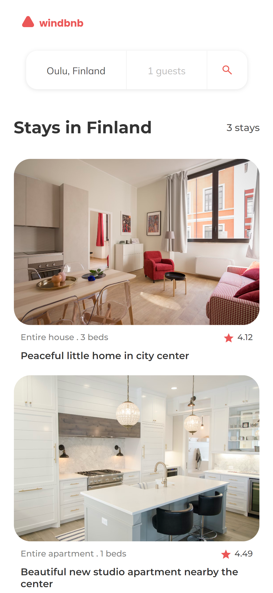

<!-- Please update value in the {}  -->

<h1 align="center">windbnb-challenge</h1>

<div align="center">
   Solution for a challenge from  <a href="http://devchallenges.io" target="_blank">Devchallenges.io</a>.
</div>

<div align="center">
  <h3>
    <a href="https://joregesosa.github.io/windbnb_challenge/">
      Demo
    </a>
    <span> | </span>
    <a href="https://Joregesosa/windbnb-challenge">
      Solution
    </a>
    <span> | </span>
    <a href="https://devchallenges.io/challenges/3JFYedSOZqAxYuOCNmYD">
      Challenge
    </a>
  </h3>
</div>

<!-- TABLE OF CONTENTS -->

## Table of Contents

- [Built With](#built-with)
- [How to use](#how-to-use)
- [Contact](#contact)

<!-- OVERVIEW -->




### Built With

<!-- This section should list any major frameworks that you built your project using. Here are a few examples.-->

- [React](https://reactjs.org/)
- [vitejs](https://vitejs.dev/)


## How To Use

<!-- Example: -->

To clone and run this application, you'll need [Git](https://git-scm.com) and [Node.js](https://nodejs.org/en/download/) (which comes with [npm](http://npmjs.com)) installed on your computer. From your command line:

```bash
# Clone this repository
$ git clone https://github.com/Joregesosa/windbnb_challenge.git

# Install dependencies
$ npm install

# Run the app
$ npm run dev
```

## Contact

- GitHub [@joregesosa](https://github.com/Joregesosa/)
